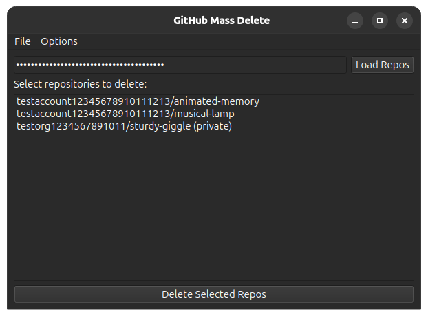
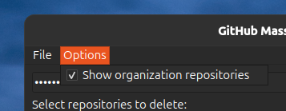

# GitHubMassDelete
Simple Python script to delete GitHub repositories in bulk.

## Usage
1. Install the dependencies listed in requirements.txt using `pip install -r requirements.txt` 
2. Run either the GUI version using `python3 GitHubMassDelete-gui.py` on Linux and macOS or `python GitHubMassDelete-gui.py` on Windows.
3. Insert token into the token field
4. Select in the Options menu if you want to show organization repositories as well
5. Select repositories to delete
6. Press delete repositories

## Screenshots

  

